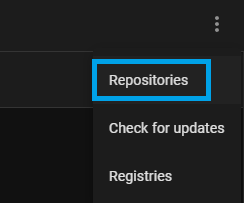
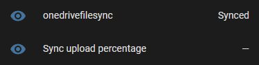
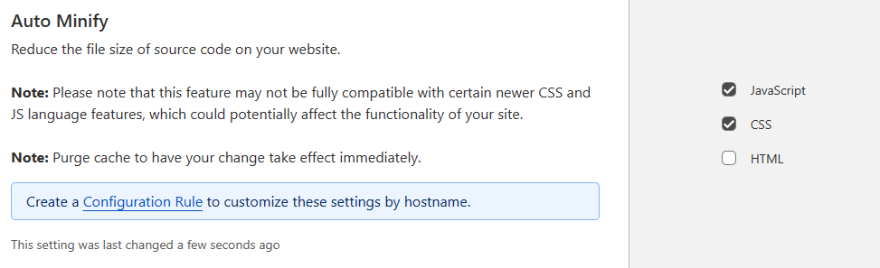
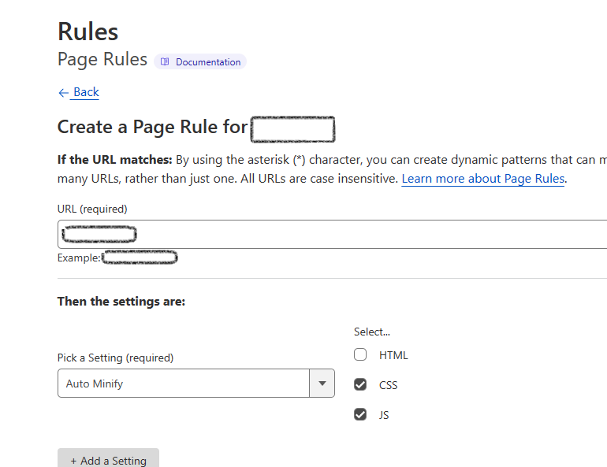

# Home Assistant OneDrive Backup

## Intro
This addon enables easy Home Assistant backup creation and sync to OneDrive. 


## Current Features
- Dedicated Web UI
- Set backup creation schedule
- Syncs backups to OneDrive **(Personal Account only. OneDrive for business not currently supported)**
- Additional File Sync to OneDrive
- Supports standard backup retention / Generational backup mode
- Retain backups indefinitely 
- Supports multiple Home Assistant instances
- Supports Home Assistant Persistent Notifications 
- Supports Home Assistant Events
- Includes Sensor Entities for Dashboards / Automations

>This is a free addon but if you enjoy this addon and would like to support the development it >would be much appreciated :)
>[](https://www.buymeacoffee.com/snirlavis)
## Quick Links
[Installation Instructions](#installation-instructions)<br/>
[Configuration](#configuration)<br/> 
[Backup Location in OneDrive](#backup-location-in-onedrive)<br/>
[Home Assistant Sensor](#home-assistant-backup-sensor)<br/>
[Events](#events)<br/>
[Restoring from backup](#restoring-from-backup)<br/>
[Security and Privacy](#security-and-privacy)<br/>
[FAQ](#faq)<br/>
[Feedback / Feature requests](#feedback--feature-requests)<br/>

## Installation Instructions
>If you've installed Add-ons before this will be pretty straightforward and you can skip reading through all the steps below **except the initial authentication parts in steps 7 and 8**.
1. From the Home Assistant frontend navigate to the Add-on Store ( **Settings** -> **Add-ons** -> **Add-on Store** [bottom right])
 
2. Select the **Repositories** option from the 3-dot menu in the top right corner and add this repository url: <https://github.com/lavinir/hassio-onedrive-backup> </br>  

> A **Preview channel** is also available to get and test newer versions earlier. If you want to participate in the preview channel use the following repository URL instead: *https://github.com/lavinir/hassio-onedrive-backup#preview*
3. Reload the Add-on page (hard refresh might be required) and scroll down. You should now see a new section titled **Home Assistant Onedrive Backup Repository** that contains the **OneDrive Backup** addon.
4. Click **Install** and wait a few minutes for the addon to download
5. I recommend setting a backup password for your Home Assistant backups. You can do this in the addon **Configuration**.

6. **Start** the addon and wait a few seconds for it to start. Once started you can navigate to the addon Web UI. 
    > **Important**! If you are using a CloudFlare tunnel or similar service you may see this error message:  To resolve this please see the relevant section in the [FAQ](#im-getting-an-error-in-the-web-interface-about-html-content-filtering)
7. You will need to **Authenticate** with OneDrive one time to allow the addon access to a dedicated backup folder in your OneDrive account. (If you're interested in the addon permissions and the authentication flow you can see more details below under [Security and Privacy](#security-and-privacy)). You can do this via the Web Interface, where there will be a banner prompting you to authenticate:  You can use the button to copy the auth code and click on the URL to start the authentication process. 
   > You can also do this without the Web Interface by opening the Add-on logs where you will have a similar line telling you to authenticate with the appropriate code.
8. Copy the code and navigate to the url as instructed. You will be asked to login to your Microsoft account and grant permissions to the App that will allow it to store your backups. . </br>
After consent has been granted you're good to go. The authentication banner will disappear from the Web Interface and will start displaying data. 
    > Alternatively, you can also verify in the logs that authentication has indeed succeeded.

## Configuration
All configuration options for the addon can be found under **Settings** in the addon's Web Interface

### **Number of local backups**
The maximum amount of backups to keep locally in Home Assistant
> Note that the number of the actual backups can temporarly exceed the set maximum by one due to the fact deletion occurs only after a new backup is created.

### **Number of OneDrive backups**
The maximum amount of backups to keep in OneDrive

### **Backup interval (days)**
The backup creation frequency in days.
> For setting a sub-day frequency you can use a number between 0 and 1, so for example if the value here is set to **0.5**, the backup frequency will occur every 12 hours. You should avoid using a value less than 0.083 (~2 hours) as the [current enforced minimum sync interval](#sync_interval_hours) is once an hour.

### **Generational backups**
By setting a value for any of the Generational retention periods (days, weeks, months, years) you are changing the default retention policy of keeping the latest backups only.
> Generational backups only effect retention and not backup creation. You should have your [Backup interval days](#backup-interval-days) set to 1 so that the generational policy has enough available backups to align with the policy.

> Generational backups do not override the maximum number of backups configured (applicable to both local and OneDrive backups). You should make sure the max backup number is enough to accomodate your Generational settings. If Max backups was reached and all backups are needed by the Generational backup settings, backups will be removed to align with the Max Backup settings (deleting the oldest backups first)
#### **Generational backups - Days**
Will attempt to keep the latest X days set in **Generational Days** 
#### **Generational backups - Weeks**
Will attempt to keep the latest backup from each week, going back X weeks, where X is weeks set in **Generational Weeks**. 
> Weeks are aligned to week number of year. First day of week is selected based on your Locale. 

#### **Generational backups - Months**
Will attempt to keep the latest backup from each month, going back X months, where X is the months set in **Generational Months**

#### **Generational backups - Years**
Will attempt to keep the latest backup from each year, going back X years, where X is the years set in **Generational Years**

### **Backup name**
Name to use for the backups created by the add-on.
> To avoid collision with backups created outside this addon please use a unique name here.

### **Monitor all local backups**
When enabled the add-on will monitor all local backups whether created by the addon or not

### **Ignore upgrade backups**
When enabled, the add-on will ignore backups that are automatically created during upgrades (of Home Assistant / Addons)

### **Backup password**
The password to use to protect the backups created and uploaded to OneDrive.
> You need to toggle the "Show unused optional configuration options" to see it in the Configuration screen.

### **Hass api timeout (minutes)**
This allows you to set the timeout configured when calling the Home Assistant APIs. 
> This applies to how long your backups take to create. If you experience timeouts during backup creation, increase this value.

### **Notify on error**
Enables persistent notifications in Home Assistant to notify of backup failures.

### **Exclude media folder**
When enabled, a partial backup will be created without the *media* folder
### **Exclude ssl folder**
When enabled, a partial backup will be created without the *ssl* folder

### **Exclude share folder**
When enabled, a partial backup will be created without the *share* folder

### **Exclude local addons folder**
When enabled, a partial backup will be created without the *addons/local* folder

### Allowed hours (Optional)
This accepts a range of hours from 0 to 23 for which only during these hours backups / syncs will be performed. If a backup is required or sync is pending it will be performed at the first window allowed in the defined hours. 
The format of this is one or more ranges seperated by a comma. A range is specified by a dash <br/>

**Example**:

```

0-2,10,21-     [Allowed hours are 00:00-02:59, 10:00-10:59 and 21:00-23:50]

```
> You need to toggle the "Show unused optional configuration options" to see it in the Configuration screen.

### Backup instance name (Optional)
If you have more than one Home Assistant installation you want to backup to the same OneDrive account, you can achieve this by specifying different **instance names** to each installation. Each instance will only look at their own backups and ignore any other instances. 
> You need to toggle the "Show unused optional configuration options" to see it in the Configuration screen.

### File Sync Paths (optional)
This allows you to specify a list of paths for the addon to sync to OneDrive so you can for example sync your **Media** folder to OneDrive and exclude it from the Backups allowing you to save storage space (as this will only be stored once). Files are stored under a new directory called **FileSync** under the [**App Folder**](#backup-location-in-onedrive). Source folder structure is maintained under this folder.
> Sync (sub)folders supported must be under one of the following roots:
> * /config
> * /ssl
> * /share
> * /media
> * /addons
> * /addon_configs
> * /homeassistant


**Example**: 

```
sync_paths:
 - /share/
 - /media/music/*.mp3
 - /share/**/*.zip
   
```

> You can use '*' as a wild card representing 0 to many characters or **/ to represent an arbitrary depth. In the examples above the paths that will be synced are (1) contents share folder and all subfolders located underneath, (2) all the .mp3 files located inside the /media/music folder (no subfolders included) and (3) all .zip files located in any directory / subdirectory under the /share folder

> Currently Sync is only preformed one way (Local -> OneDrive). 

### Remove deleted files during File Sync
When enabled, the FileSync folder on OneDrive will mirror your included [Sync Paths](#file-sync-paths-optional) meaning any 'extra' content that remains in OneDrive will be removed.

### Ignore allowed hours for File Sync
When enabled, [Allowed Hours](#allowed-hours-optional) will be ignored for File Syncing and allow syncing to occur in all hours (this does **not** effect backups, only File Syncing)

### Excluded Addons (Optional)
When enabled, partial backups will be created excluding the addons specified in this list. You need to specify the addon id (slug) in this list. To find the correct slug you can navigate in Home Assistant to **Settings** -> **Addons** and click on an addon. When you are in the addon Info screen you will see the addon slug in the url: ht<area>tps://your.homeassistant.host/hassio/addon/**addonslug**/info

### Log Level
You can opt to see more / less logs by adjusting the verbosity of the addon logs. Possible values are (verbose, info, warning, error)

### Enable Anonymous Telemetry
Sends anonymous telemetry once a day containing data about which features are enabled in the addon. This helps focus development on relevant features and improve the addon.

**What data is sent?**
A random Guid is generated when you run your addon for the first time (not persisted through uninstall). That is sent along with the following data:
* File Sync Enabled Flag
* Generational Backups Enabled Flag
* Backup Allowed Hours Enabled Flag
* Instance Name Enabled Flag (The instance name is **NOT** sent)
* Monitor all Local Backups Enabled Flag
* Ignore Upgrade Backups Enabled Flag
* Ignore Allowed Hours for File Sync Enabled Flag
* Addon Version
* Notify On Error Enabled Flag
* Error Reporting Enabled Flag

### Enable Anonymous Error Reporting
Sends anonymous error messages (with exceptions) to help identify issues with the addon

### Dark Mode
Use Dark mode for Addon UI

## Backup Location in OneDrive
The add-on has specific permissions to a single folder in your OneDrive known as the **App Folder**. (More details can be found in the [Security and Privacy](#security-and-privacy) section.)

The App Folder for the add-on is mapped to : <kbd>**[onedriveroot]/Apps/hassio-onedrive-backup**</kbd>

## Retaining Backups Indefinitely (Prevent Deletion)
You can choose to 'pin' specific backups so that they stop counting against the set backup quotas and are never deleted by the addon. This can be set individually for both local and OneDrive through
dedicated buttons in the main Dashboard for each backup. 
> Note - As any 'retained' backup will not count towards your maximum backup quota you could for example, have a maximum of 3 local backups set but chose to retain 2 Local backups. The addon will ignore the retained backups for the quota and will store a maximum of 3 addtional local backups

## Home Assistant backup sensor
The add-on creates a native Home Assistant Sensor entity <kbd>sensor.onedrivebackup</kbd> which grants visibility to the backup status as well as allows you to create automations on these values as needed.


### Sensor State
There are 5 possible states for the sensor: 

#### <kbd>**Backed_Up**</kbd>
   
All backups are fresh and within the maximum set values both locally and on OneDrive. This is the optimal state for the sensor to be in.

#### <kbd>**Backed_Up_Local**</kbd>

Local backups are fresh and within defined limits, however this indicates possible staleness in the OneDrive backups.
> Additional visiblity into the full backup state can be found in the [Sensor Attributes](#sensor-attributes) below.

#### <kbd>**Backed_Up_Onedrive**</kbd>
OneDrive backups are fresh and within defined limits, however this indicates possible staleness in the local backups.
> Additional visiblity into the full backup state can be found in the [Sensor Attributes](#sensor-attributes) below.

#### <kbd>**Syncing**</kbd>
Syncing to OneDrive is in progress. 
#### <kbd>**Stale**</kbd>
All backups (local and OneDrive) are outside the defined backup interval configured.

### Sensor Attributes
The sensor also exposes the following attributes:

#### <kbd>**Last Local backup date**</kbd>
Date of the latest backup that exists locally in Home Assistant
#### <kbd>**Last OneDrive backup date**</kbd>
Date of the latest backup that exists in OneDrive

#### <kbd>**Backups in Home Assistant**</kbd>
Number of backups that exist locally in Home Assistant

#### <kbd>**Backups in OneDrive**</kbd>
Number of backups that exist in OneDrive
#### <kbd>**Current backup upload percentage**</kbd>
When a backup upload is in progress this will show the progress of the upload.

#### <kbd>**Current backup upload speed (KB/s)**</kbd>
When a backup upload is in progress this will show the transfer speed of the upload.

#### <kbd>**Backup download percentage**</kbd>
When a backup download is in progress this shows the progres of the download.

## Home Assistant file sync sensor
The add-on creates a native Home Assistant Sensor entity <kbd>sensor.onedrivefilesync</kbd> which grants visibility to the file sync status as well as allows you to create automations on these values as needed.



### Sensor State
There are 2 possible states for the sensor: 

#### <kbd>**Synced**</kbd>
   
All files specified in the [Sync Paths](#sync_paths-optional) are backed up to OneDrive.

#### <kbd>**Syncing**</kbd>

Files are being synced to OneDrive.

### Sensor Attributes
The sensor also exposes the following attributes:

#### <kbd>**Current File upload percentage**</kbd>
When a file upload is in progress this will show the progress of the upload.

#### <kbd>**Current file upload speed (KB/s)**</kbd>
When a file upload is in progress this will show the transfer speed of the upload.

## Events
Upon a failure in the backup process, the addon will fire different events you can use in your automations:

### <kbd>onedrive.BackupCreateFailed</kbd>
This event will fire when a backup could not be created locally.

### <kbd>onedrive.BackupUploadFailed</kbd>
This event will fire when a backup upload to OneDrive has failed.

### <kbd>onedrive.OneDriveBackupDeleteFailed</kbd>
This event will fire when deleting a backup from OneDrive (based on [defined retention](#onedrive_backup_num_to_keep)) has failed.

### <kbd>onedrive.LocalBackupDeleteFailed</kbd>
This event will fire when deleting a local backup from Home Assistant (based on [defined retention](#local_backup_num_to_keep)) has failed.
## Restoring from Backup 
To restore a backup head to the **Settings** -> **System** -> **Backups** menu. From there you should see all your local backups. You can choose any one from the list and recover Home Assistant from them.
> For backups in OneDrive only, you will first want to sync them back locally. 
This can be done via the Web Interface by clicking the **Download** backup on the specific backup you wish to restore. It will be automatically uploaded to Home Assistant and visible in the **Backups** section. 

## Security and Privacy

### Authentication
Authentication with OneDrive uses [Microsoft's Device Code Flow]("https://learn.microsoft.com/en-us/azure/active-directory/develop/v2-oauth2-device-code"). At no point is the addon exposed to your account password. Once permission has been granted, a token is cached locally which is used for future authentications. The token only has access to a single special [**App Folder**]("https://learn.microsoft.com/en-us/onedrive/developer/rest-api/concepts/special-folders-appfolder?view=odsp-graph-online") created by the Application and has no access to any of your OneDrive files outside of this dedicated folder. Granting access to the application does not grant access to me or anyone else access to this folder outside of the current flow for the add-on on your device.

### Privacy
#### Local
The only things stored locally are:
1. Backups (stored in Home Assistant and password protected)
2. The authentication token mentioned above in [Authentication](#authentication)

#### Remote
Outside the backups uploaded to your OneDrive account, no data is sent anywhere else. 

## FAQ
### **Is OneDrive for Business supported ?**
No. Currently OneDrive for Business does not support the special **App Folder** mentioned [above](#authentication) which allows restricting the addo-ons access only to it's own folder and would require full access to the the users entire OneDrive.
### **I'm getting an "Error: Failed creating new backup" message** 
The default timeout for backup creation is 30 minutes. For large installations, backup creation could exceed this time. You can increase the [timeout value](#hass_api_timeout_minutes) in your configuration.

### **I only want my backups to run at specific hours** 
This can be done using the [Allowed hours (Optional) configuration](#allowed-hours-optional)

### **I have more than one Home Assistant installation I want to back up** 
See how to configure [Instance names](#backup_instance_name-optional)

### **HTML Content Filtering Error** 
The Web UI uses the Blazor framework which relies on injecting Html comments into the dom for tracking purposes for the Blazor components. Service like CloudFlare (e.g. for those using the CloudFlared addon to access Home Assistant outside of their network) have **"Auto Minify"** features, which can include removing comment blocks from served HTML pages. If this occurs it breaks the Blazor framework and you will receive an appropriate error in the Addon WebUI.
Below are instructions to resolve this for a **CloudFlare** tunnel:

**Option 1 - Disable Auto Minify**
You can disable auto minify by [logging in to the Cloudflare dashboard](https://dash.cloudflare.com/login), selecting your account and website. Then go to the **Speed** -> **Optimization** section and uncheck **HTML** under **Auto Minify**
 
**Option 2 - Use a Page Rule**
If you do not want to do this globally you can also use a **Page Rule** by going to **Rules** -> **Page Rules** instead. You can then select the URL you want to disable HTML minification for (e.g. https://your.homeassistant.host/*) and choose the **Auto Minify** settings and deselect **HTML**:
 
> Note: If you want to use a more specific URL just for the addon (though you probably don't really need that) you will need to use the Home Assistant assigned Ingress URL allocated to the Addon. You can get this from the logs when setting them to **Verbose**

## Feedback / Feature requests
If you use and like this addon and want to show support you could do so by starring the official [Repo on GitHub]("https://github.com/lavinir/hassio-onedrive-backup") or [](https://www.buymeacoffee.com/snirlavis)

For Bugs / Issues please open an [Issue on GitHub]("https://github.com/lavinir/hassio-onedrive-backup/issues")

For new suggestions / feedback please use the official repo [GitHub Disucssions](https://github.com/lavinir/hassio-onedrive-backup/discussions/categories/ideas)
