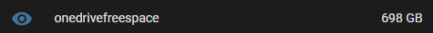
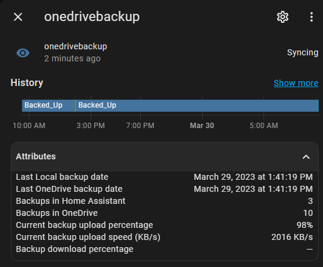
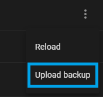

# Home Assistant OneDrive Backup

## Intro
This addon enables easy Home Assistant backup creation and sync to OneDrive. 

## Current Features
- Set backup creation schedule
- Syncs backups to OneDrive **(Personal Account only. OneDrive for business not currently supported)**
- Recovery mode for loading backups back from OneDrive to Home Assistant
- Supports backup retention for removing older backups
- Support Home Assistant Persistent Notifications 
- Includes Sensor Entities for Dashboards / Automations

>This is a free addon but if you enjoy this addon and would like to support the development it >would be much appreciated :)

>

## Installation Instructions
>If you've installed Add-ons before this will be pretty straightforward and you can skip reading thorugh all the steps below **except the initial authentication parts in steps 7 and 8**.
1. From the Home Assistant frontend navigate to the Add-on Store ( **Settings** -> **Add-ons** -> **Add-on Store** [bottom right])
 
2. Select the **Repositories** option from the 3-dot menu in the top right corner and add this repository url: <https://github.com/lavinir/hassio-onedrive-backup>    

3. Reload the Add-on page (hard refresh might be required) and scroll down. You should now see a new section titled **Home Assistant Onedrive Backup Repository** that contains the **OneDrive Backup** addon.
4. Click **Install** and wait a few minutes for the addon to download
5. Before you are able to start the addon, you will be asked to set a password for your Home Assistant backups (I've currently made this mandatory for security best practices). Either navigate to **Configuration** in the addon menu on top or attempt to **Start** it (which will navigate to the **Configuration** section for you and ask you to input a Backup password)
6. **Start** the addon and wait a few seconds for it to start.
7. You will need to **Authenticate** with OneDrive one time to allow the addon access to a dedicated backup folder in your OneDrive account. (If you're interested in the addon permissions and the authentication flow you can see more details below under [Security and Privacy](#security-and-privacy)). Open the Addon **Logs** from the Add-on menu on top and you should see the following lines: <kbd>To sign in, use a web browser to open the page https://microsoft.com/devicelogin and enter the code ********* to authenticate. </kbd>
8. Copy the code and navigate to the url as instructed. You will be asked to login to your Microsoft account and grant permissions to the App that will allow it to store your backups. .  
After consent has been granted you're good to go (you can verify in the logs that authentication has indeed succeeded)

## Configuration
All configuration options for the addon can be found in the native **Configuration** section of the addon in Home Assistant. 

### **recovery_mode**
When this settings is toggled on, the add-on will not perform any backups and sync mode will reverse from OneDrive back to Home Assistant.
This will still respect the [maximum local backups](#local_backup_num_to_keep) set and will try to sync back the latest backups that exist in OneDrive while remaining under the set limit.

> See [Restoring from backup](#restoring-from-backup) for additional information on how to recover from a backup.

### **local_backup_num_to_keep**
The maximum amount of backups to keep locally in Home Assistant
> Note that the number of the actual backups can temporarly exceed the set maximum by one due to the fact deletion occurs only after a new backup is created.

### **onedrive_backup_num_to_keep**
The maximum amount of backups to keep in OneDrive

### **backup_interval_days**
The backup creation frequency in days.
> For setting a sub-day frequency you can use a number between 0 and 1, so for example if the value here is set to **0.5**, the backup frequency will occur every 12 hours. You should avoid using a value less than 0.083 (~2 hours) as the [current enforced minimum sync interval](#sync_interval_hours) is once an hour.

> **NOTE**: There is a bug in the Home Assistant UI that will light up the value in red (invalid) when you try to use a non whole number here. Ignore this and save the configuration with the value you want.

### **sync_interval_hours**
The addon periodically "wakes up" to make sure backups are synced and created according to the set schedules. This allows customizing the 'wake up' frequency. 
> The Add-on will ignore this setting if you set the interval higher than required to maintain the backup schedule set. 

> **NOTE**: Minimum value here is 1 hour. 

### **backup_name**
Name to use for the backups created by the add-on.
> To avoid collision with backups created outside this addon please use a unique name here.

### **backup_passwd**
The password to use to protect the backups created and uploaded to OneDrive.
> Currently this is mandatory to set as I don't think it makes sense to store these unprotected.

### **hass_api_timeout_minutes**
This allows you to set the timeout configured when calling the Home Assistant APIs. 
> This applies to how long your backups take to create. If you experience timeouts during backup creation, increase this value.

### **notify_on_error**
Enables persistent notifications in Home Assistant to notify of backup failures.

### **exclude_media_folder**
When enabled, a partial backup will be created without the *media* folder
### **exclude_ssl_folder**
When enabled, a partial backup will be created without the *ssl* folder

### **exclude_share_folder**
When enabled, a partial backup will be created without the *share* folder

### **exclude_local_addons_folder**
When enabled, a partial backup will be created without the *addons/local* folder

## Backup Location in OneDrive
The add-on has specific permissions to a single folder in your OneDrive known as the **App Folder**. (More details can be found in the [Security and Privacy](#security-and-privacy) section.)

The App Folder for the add-on is mapped to : <kbd>**[onedriveroot]/Apps/hassio-onedrive-backup**</kbd>

## OneDrive free space Sensor
The add-on creates a native Home Assistant Sensor entity <kbd>sensor.onedrivefreespace</kbd> that will show you the amount of free space in your OneDrive account.

## Home Assistant sensor
The add-on creates a native Home Assistant Sensor entity <kbd>sensor.onedrivebackup</kbd> which allows convinient visibility to the backup status as well as allows you to create automations on these values as needed.

### Sensor State
There are 5 possible states for the sensor: 

#### <kbd>**Backed_Up**</kbd>
   
All backups are fresh and within the maximum set values both locally and on OneDrive. This is the optimal state for the sensor to be in.

#### <kbd>**Backed_Up_Local**</kbd>

Local backups are fresh and within defined limits, however this indicates possible staleness in the OneDrive backups.
> Additional visiblity into the full backup state can be found in the [Sensor Attributes](#sensor-attributes) below.

#### <kbd>**Backed_Up_Onedrive**</kbd>
OneDrive backups are fresh and within defined limits, however this indicates possible staleness in the local backups.
> Additional visiblity into the full backup state can be found in the [Sensor Attributes](#sensor-attributes) below.

#### <kbd>**Syncing**</kbd>
Backup creation / syncing to OneDrive is in progress. 
#### <kbd>**Stale**</kbd>
All backups (local and OneDrive) are outside the defined backup interval configured.

### Sensor Attributes
The sensor also exposes the following attributes:

#### <kbd>**Last Local backup date**</kbd>
Date of the latest backup that exists locally in Home Assistant
#### <kbd>**Last OneDrive backup date**</kbd>
Date of the latest backup that exists in OneDrive

#### <kbd>**Backups in Home Assistant**</kbd>
Number of backups that exist locally in Home Assistant

#### <kbd>**Backups in OneDrive**</kbd>
Number of backups that exist in OneDrive
#### <kbd>**Current backup upload percentage**</kbd>
When a backup upload is in progress this will show the progress of the upload.

#### <kbd>**Backup download percentage**</kbd>
When a backup download is in progress (Recovery Mode), this shows the progres of the download.

## Restoring from Backup 
To restore a backup head to the **Settings** -> **System** -> **Backups** menu. From there you should see all your local backups. You can choose any one from the list and recover Home Assistant from them.
> For backups in OneDrive only, you will first want to sync them back locally. See [Recovery Mode](#recovery-mode) below for details.

### Recovery Mode
Recovery Mode can be enabled from the add-on configuration panel. Once enabled, the add-on will cease all backup creation and syncing from Home Assistant to OneDrive. Instead, it will attempt to sync back the latest backups from OneDrive to Home Assistant. 
The number of backups that will sync back will be capped by the amount of [maximum local backups](#local_backup_num_to_keep) configured. 

> In case you cannot sync the backup you want because it is too old and you are unable to sync all the newer backups to Home Assistant because of storage capacity (or just prefer not to) you can manually download the backup from OneDrive and upload the backup from this screen by clicking the 3-dot menu on the top right and choosing the **Upload Backup** option.

## Security and Privacy

### Authentication
Authentication with OneDrive uses [Microsoft's Device Code Flow]("https://learn.microsoft.com/en-us/azure/active-directory/develop/v2-oauth2-device-code"). At no point is the addon exposed to your account password. Once permission has been granted, a token is cached locally which is used for future authentications. The token only has access to a single special [**App Folder**]("https://learn.microsoft.com/en-us/onedrive/developer/rest-api/concepts/special-folders-appfolder?view=odsp-graph-online") created by the Application and has no access to any of your OneDrive files outside of this dedicated folder. Granting access to the application does not grant access to me or anyone else access to this folder outside of the current flow for the add-on on your device.

### Privacy
#### Local
The only things stored locally are:
1. Backups (stored in Home Assistant and password protected)
2. The authentication token mentioned above in [Authentication](#authentication)

#### Remote
Outside the backups uploaded to your OneDrive account, no data is sent anywhere else. 

## Feedback / Feature requests
If you use and like this addon and want to show support you could do so by starring the official [Repo on GitHub]("https://github.com/lavinir/hassio-onedrive-backup") or 

For Bugs / Issues please open an [Issue on GitHub]("https://github.com/lavinir/hassio-onedrive-backup/issues")

I do already have some plans for future features but you can also email me at <snirlavi@gmail.com> for any suggestions and other feedback.

